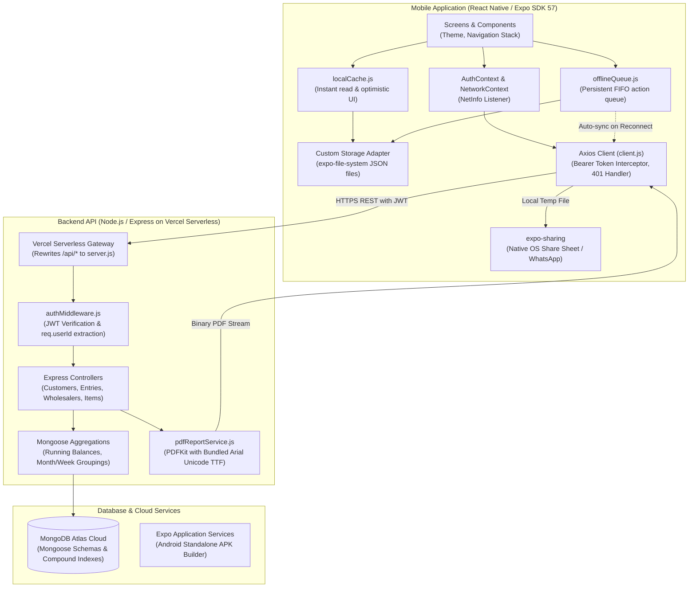

# Technical Architecture — Daily Tally (Karobar Hisab)

## 1. High-Level Architecture

Daily Tally is structured as a client-server full-stack application consisting of an Expo-based React Native mobile application, a Node.js Express REST API deployed on Vercel Serverless Functions, and a cloud MongoDB Atlas database.

### System Architecture Diagram



---

## 2. Technology Stack

### Mobile Application (`/mobile`)
| Category | Technology | Version | Purpose |
|---|---|---|---|
| **Framework** | Expo SDK | `~57.0.24` | Universal React Native development runtime |
| **Core Library** | React | `19.2.3` | UI component tree management |
| **Mobile Runtime** | React Native | `0.86.3` | Native Android and iOS components |
| **Navigation** | `@react-navigation/native` & `native-stack` | `^7.3.18` / `^7.18.10` | Screen routing, headers, and modal navigation stacks |
| **HTTP Client** | Axios | `^1.20.0` | API requests, auth interceptors, timeout handling |
| **Secure Storage** | `expo-secure-store` | `~57.0.4` | Encrypted storage for JWT auth tokens |
| **File System Storage** | `expo-file-system` (`/legacy`) | `~57.0.7` | Sandboxed JSON file persistence for offline storage |
| **File Sharing** | `expo-sharing` | `~57.0.21` | Native Android/iOS share sheets for PDF export |
| **Date & Time Picker** | `@react-native-community/datetimepicker` | `9.1.0` | Native calendar and clock inputs |
| **Network Monitoring** | `@react-native-community/netinfo` | `^12.0.1` | Real-time cellular/Wi-Fi connection detection |
| **UI Safety** | `react-native-safe-area-context` | `~5.7.0` | Hardware notch and Android system bar padding |
| **Screen Transitions** | `react-native-screens` | `~4.26.0` | Native view controllers for screen transition performance |

### Backend API (`/backend`)
| Category | Technology | Version | Purpose |
|---|---|---|---|
| **Runtime** | Node.js | `v20.x` | Server-side JavaScript execution |
| **Web Framework** | Express.js | `^4.19.2` | REST API routing and middleware pipeline |
| **Database ODM** | Mongoose | `^8.3.0` | MongoDB schemas, validation, aggregation pipelines |
| **Security / Auth** | `jsonwebtoken` | `^9.0.2` | Stateless cryptographic JWT authentication |
| **Password Hashing** | `bcryptjs` | `^2.4.3` | Salted SHA-512 password hashing |
| **PDF Generation** | `pdfkit` | `^0.20.2` | Vector drawing, table generation, and stream output |
| **CORS Middleware** | `cors` | `^2.8.5` | Cross-origin resource sharing policy management |
| **Environment** | `dotenv` | `^16.4.5` | Development environment variable loader |
| **Development Tool** | `nodemon` | `^3.1.0` | Auto-restarting development server |

### Super Admin Web Dashboard (`/admin-web`)
| Category | Technology | Version | Purpose |
|---|---|---|---|
| **Framework** | Next.js (App Router) | `14.2.24` | React full-stack framework for platform oversight portal |
| **Core Library** | React / React DOM | `18.3.1` | Concurrent UI rendering |
| **Language** | TypeScript | `^5.6.2` | Strict end-to-end typing without `any` |
| **Styling** | Tailwind CSS + Sass | `3.4.13` / `1.79.4` | Utility classes & SCSS modules for tables and snapshot trees |
| **UI Animations** | Framer Motion | `^11.11.1` | Modal drawers, route transitions, staggered row appearances |
| **KPI Animations** | GSAP | `^3.12.5` | Numerical count-up interpolation on KPI metric cards |
| **Icons** | Lucide React | `^0.447.0` | Modern SVG iconography |

### Cloud & DevOps
- **Hosting Platform**: Vercel (`@vercel/node` for backend REST API; Next.js runtime for Super Admin web dashboard).
- **Database**: MongoDB Atlas (Cloud database with replica sets).
- **Build Service**: Expo EAS Build (Cloud CI/CD building standalone Android APKs).

---

## 3. Current Folder Structure

```
DailyTally/
├── CHANGELOG.md                   # Application version history and release notes
├── README.md                      # High-level monorepo overview
├── vercel.json                    # Root Vercel serverless routing & asset bundling config
├── docs/                          # Comprehensive technical documentation
│   ├── PRD.md                     # Product requirements & business scope
│   ├── ARCHITECTURE.md            # System architecture, data flow & schemas
│   ├── RULES.md                   # Coding rules, security, & standards
│   ├── DESIGN.md                  # Design system tokens & reusable UI catalog
│   ├── TASKS.md                   # Phase-by-phase task tracking
│   └── MEMORY.md                  # Project memory, decision logs & active state
├── backend/                       # Node.js Express REST API
│   ├── .env.example               # Template environment variables
│   ├── package.json               # Backend dependencies and scripts
│   ├── server.js                  # Main server entrypoint & router aggregator
│   ├── vercel.json                # Backend-specific Vercel build manifest
│   ├── config/
│   │   └── db.js                  # Cached MongoDB connection pool handler
│   ├── controllers/
│   │   ├── authController.js      # User registration, login, profile, password
│   │   ├── customerAuthController.js # Customer phone-only login & JWT issuance
│   │   ├── customerController.js  # Customer CRUD and balance aggregation (soft-delete enabled)
│   │   ├── customerPortalController.js # Read-only customer hisab & statement PDF
│   │   ├── entryController.js     # Customer item & payment transactions (soft-delete enabled)
│   │   ├── itemController.js      # Customer item catalog management (soft-delete enabled)
│   │   ├── reportController.js    # Customer PDF statement compilation
│   │   ├── superAdminAuthController.js # Super Admin login & token issuance
│   │   ├── superAdminController.js # Super Admin read-only platform oversight & audit inspection
│   │   ├── wholesalerController.js# Wholesaler profiles & net calculations (soft-delete enabled)
│   │   ├── wholesalerEntryController.js # Wholesaler purchase, payment, advance (soft-delete enabled)
│   │   ├── wholesalerItemController.js  # Wholesaler item catalog management (soft-delete enabled)
│   │   └── wholesalerReportController.js# Wholesaler PDF statement compilation
│   ├── fonts/
│   │   ├── arial.ttf              # Unicode regular font for PDF generation
│   │   └── arialbd.ttf            # Unicode bold font for PDF generation
│   ├── middleware/
│   │   ├── authMiddleware.js      # Staff JWT verification & tenant scoping
│   │   ├── customerAuthMiddleware.js # Customer portal JWT verification (tokenType: customer)
│   │   └── superAdminMiddleware.js# Super Admin JWT verification (tokenType: superadmin)
│   ├── models/
│   │   ├── User.js                # Shopkeeper / Account schema (soft-delete enabled)
│   │   ├── Customer.js            # Customer (Gahak) profile schema (soft-delete enabled)
│   │   ├── Item.js                # Customer sale item catalog schema (soft-delete enabled)
│   │   ├── Entry.js               # Customer credit & payment transaction schema (soft-delete enabled)
│   │   ├── Wholesaler.js          # Wholesaler (Saudagar) profile schema (soft-delete enabled)
│   │   ├── WholesalerItem.js      # Wholesaler purchase item catalog schema (soft-delete enabled)
│   │   ├── WholesalerEntry.js     # Wholesaler purchases, payments, advances schema (soft-delete enabled)
│   │   ├── SuperAdmin.js          # Platform Super Admin account schema
│   │   └── AuditLog.js            # Immutable audit trail with full document snapshots
│   ├── routes/
│   │   ├── authRoutes.js          # Staff auth endpoints
│   │   ├── customerAuthRoutes.js  # Customer phone login endpoints
│   │   ├── customerPortalRoutes.js# Read-only customer hisab endpoints
│   │   ├── customerRoutes.js      # Customer management endpoints
│   │   ├── entryRoutes.js         # Transaction entries endpoints
│   │   ├── itemRoutes.js          # Item master endpoints
│   │   ├── reportRoutes.js        # PDF report endpoints
│   │   ├── superAdminRoutes.js    # Super Admin login & platform oversight endpoints
│   │   ├── wholesalerEntryRoutes.js # Wholesaler transactions endpoints
│   │   ├── wholesalerItemRoutes.js# Wholesaler item catalog endpoints
│   │   ├── wholesalerReportRoutes.js # Wholesaler report endpoints
│   │   └── wholesalerRoutes.js    # Wholesaler management endpoints
│   ├── scripts/
│   │   ├── createSuperAdmin.js    # One-time CLI script to initialize Super Admin account
│   │   └── testSuperAdminScenario.js # Automated verification for Super Admin & audit logging
│   └── services/
│       └── pdfReportService.js    # Shared PDFKit vector engine with Unicode layout
└── mobile/                        # React Native / Expo Application
    ├── App.js                     # Root entry point initializing context providers
    ├── app.json                   # Expo application manifest & bundle configuration
    ├── eas.json                   # Expo Application Services build profiles (APK)
    ├── index.js                   # Application registration entry point
    ├── metro.config.js            # Metro bundler configuration
    ├── package.json               # Mobile dependencies and run scripts
    ├── assets/                    # App icons, splash screens, and adaptive assets
    └── src/
        ├── api/                   # HTTP client layer
        │   ├── client.js          # Axios instance, dual-token resolution, interceptors
        │   ├── authApi.js         # Auth requests (login, signup, profile, password)
        │   ├── customerPortalApi.js# Customer portal API (phone login, profile, entries, PDF)
        │   ├── customerApi.js     # Customer endpoints & monthly summaries
        │   ├── entryApi.js        # Entry mutations (add item, payment, delete)
        │   ├── itemApi.js         # Customer item catalog API
        │   ├── reportApi.js       # Customer PDF download handler
        │   ├── wholesalerApi.js   # Wholesaler endpoints & monthly summaries
        │   ├── wholesalerEntryApi.js # Wholesaler entry mutations & settlements
        │   ├── wholesalerItemApi.js  # Wholesaler item catalog API
        │   └── wholesalerReportApi.js# Wholesaler PDF download handler
        ├── components/            # Reusable UI component library
        │   ├── Card.js            # Tactile white container with subtle shadow
        │   ├── PrimaryButton.js   # Themed button supporting loading & variants
        │   ├── EmptyState.js      # Graphical placeholder when lists are empty
        │   ├── LoadingSpinner.js  # Centered activity indicator
        │   ├── UpdatingIndicator.js# Non-intrusive background sync badge
        │   ├── NetworkStatusBanner.js # Offline warning & pending sync badge
        │   ├── ProfileDropdownMenu.js # Top-right profile/logout action modal
        │   ├── EntryTypeFilter.js # Segmented pill filter (All/Udhaar/Wasool)
        │   ├── EyeIcon.js         # SVG password visibility toggle
        │   ├── ItemDropdown.js    # Customer item picker with default rates
        │   ├── WholesalerItemDropdown.js # Wholesaler item picker
        │   ├── SendReportModal.js # Customer PDF date-range selector & share
        │   └── WholesalerSendReportModal.js # Wholesaler PDF date-range selector
        ├── constants/
        │   └── theme.js           # Design tokens (colors, typography, spacing)
        ├── context/
        │   ├── AuthContext.js     # Staff session provider (authToken)
        │   ├── CustomerAuthContext.js # Customer session provider (customerAuthToken)
        │   └── NetworkContext.js  # Online detection & offline queue coordinator
        ├── navigation/
        │   ├── AppNavigator.js    # Root dynamic navigator (Logged out vs Staff vs Customer)
        │   └── CustomerPortalNavigator.js # Customer Portal stack (Home, Month, Week)
        ├── screens/               # Screen views
        │   ├── customerPortal/    # Dedicated Customer Portal screens (Read-Only)
        │   │   ├── CustomerLoginScreen.js # Phone-only login with multi-shop selector
        │   │   ├── CustomerPortalHomeScreen.js # Bank-statement style summary & months
        │   │   ├── CustomerPortalMonthDetailScreen.js # Month breakdown & weekly cards
        │   │   └── CustomerPortalWeekDetailScreen.js  # Day-wise entry cards & filter
        │   ├── LoginScreen.js     # User login with Customer Portal entry point
        │   ├── SignupScreen.js    # Shop registration
        │   ├── HomeScreen.js      # Main hub (Customer vs Wholesaler cards)
        │   ├── ProfileScreen.js   # User info, profile edit, password change
        │   ├── DashboardScreen.js # Customer Udhaar list with search & balances
        │   ├── CustomerDetailScreen.js # Customer info & monthly balance cards
        │   ├── MonthDetailScreen.js    # Monthly summary & weekly cards
        │   ├── WeekDetailScreen.js     # Weekly transactions & entry cards
        │   ├── AddEditCustomerScreen.js# Add or modify customer name/phone
        │   ├── ManageItemsScreen.js    # Customer item catalog
        │   ├── AddEditItemScreen.js    # Add/edit customer item rate
        │   ├── AddItemEntryScreen.js   # Log Udhaar entry
        │   ├── AddPaymentEntryScreen.js# Log Wasool Raqam entry
        │   ├── WholesalerListScreen.js # Wholesaler list with net balances
        │   ├── WholesalerDetailScreen.js # Wholesaler profile & advance pool
        │   ├── WholesalerMonthDetailScreen.js # Wholesaler month & weekly cards
        │   ├── WholesalerWeekDetailScreen.js  # Wholesaler weekly entries & settlement
        │   ├── AddEditWholesalerScreen.js     # Add or modify wholesaler
        │   ├── ManageWholesalerItemsScreen.js # Wholesaler item catalog
        │   ├── AddPurchaseEntryScreen.js      # Complex delivery entry (extra/shortage)
        │   ├── AddWholesalerPaymentScreen.js  # Direct wholesaler payment
        │   └── AddWholesalerAdvanceScreen.js  # Disburse advance payment
        └── storage/               # Offline storage and synchronization
            ├── storageAdapter.js  # Expo FileSystem documentDirectory JSON storage
            ├── localCache.js      # Cached reads/writes for customers/items/summaries
            └── offlineQueue.js    # Persistent FIFO queue with temporary ID remapping
└── admin-web/                     # Super Admin Web Dashboard (Next.js 14 / TypeScript)
    ├── package.json               # Dependencies (Next 14, React 18, GSAP, Framer Motion, Sass)
    ├── tsconfig.json              # TypeScript bundler module resolution
    ├── tailwind.config.ts         # Dark theme color palette & typography
    ├── vercel.json                # Vercel framework definition
    ├── types/
    │   └── superAdmin.ts          # Strict TypeScript interfaces matching backend responses
    ├── styles/
    │   ├── _variables.scss        # SCSS tokens (colors, borders, fonts)
    │   ├── globals.scss           # Tailwind directives & global resets
    │   ├── tables.module.scss     # Custom table styling & soft-delete visual markers
    │   └── snapshot.module.scss   # Snapshot inspector formatted key-value tree viewer
    ├── lib/
    │   ├── apiClient.ts           # Typed API fetch client with Bearer auth & 401 redirect
    │   └── formatters.ts          # Currency, date, and relative time formatters
    ├── context/
    │   └── AuthContext.tsx        # Super Admin session & token state in localStorage
    ├── components/
    │   ├── Header.tsx             # Breadcrumbs & action buttons header
    │   ├── MetricCard.tsx         # KPI card with GSAP count-up number interpolation
    │   ├── Sidebar.tsx            # Navigation sidebar with active highlight
    │   ├── SkeletonTable.tsx      # Animated shimmer placeholder table
    │   ├── SnapshotModal.tsx      # Framer Motion modal with tree view & raw JSON
    │   └── StatusBadge.tsx        # Active vs Soft-Deleted indicator with user attribution
    └── app/
        ├── layout.tsx             # Root layout with AuthProvider & styles
        ├── page.tsx               # Root redirect (/ -> /shops or /login)
        ├── login/page.tsx         # Glassmorphism Super Admin login form
        └── (dashboard)/
            ├── layout.tsx         # Protected dashboard layout with Sidebar & auth guard
            ├── shops/page.tsx     # Shops directory with GSAP KPI metrics & search
            ├── shops/[shopId]/    # Shop detail with Customer and Wholesaler ledger tabs
            ├── customers/[customerId]/ # Customer full ledger history & deleted flags
            ├── wholesalers/[wholesalerId]/ # Wholesaler full ledger & shortage breakdowns
            └── audit-log/page.tsx # Platform audit trail with multi-filter & snapshot inspection
```

---

## 4. How Components Connect & Data Flow

### 4.1. Authentication Flow
1. **Login Request**: User submits credentials on `LoginScreen`.
2. **Password Verification**: Backend compares `bcrypt.compare(password, user.passwordHash)`.
3. **Token Issuance**: Backend issues a signed JWT containing `{ userId: user._id }` with a 30-day expiration.
4. **Secure Storage**: Mobile client saves token to hardware-encrypted storage using `expo-secure-store` under key `authToken`.
5. **Axios Interceptor**: `client.js` attaches `Authorization: Bearer <token>` to all outbound HTTP requests.
6. **Session Termination**: If the backend returns `401 Unauthorized`, Axios interceptor catches the response, invokes `onUnauthorizedCallback`, alerts the user, clears `authToken`, and transitions `AppNavigator` back to `LoginScreen`.

### 4.2. Tenant Isolation & Database Scoping
- **Zero Cross-Tenant Leakage**: Every query and mutation is filtered by `req.userId`.
- For top-level entities (`Customer`, `Wholesaler`, `Item`, `WholesalerItem`), queries explicitly match `{ userId: req.userId }`.
- For entries (`Entry`, `WholesalerEntry`), the controller verifies that the parent entity belongs to `req.userId` before creating, querying, or deleting entries.

### 4.3. Offline-First Caching & Queue Synchronization
1. **Initial Screen Render**: Screens read from `localCache.js` on mount. If cached data exists in `storageAdapter.js`, the screen renders immediately in `< 50ms`.
2. **Background Network Revalidation**: The screen fires a background request via `apiClient`. Upon response, the local cache is updated and UI reflects fresh data (`UpdatingIndicator` shows brief sync).
3. **Offline Write Interception**: If the network is unavailable (detected via `NetInfo` or Axios timeout):
   - The action is assigned a temporary ID (e.g., `local-entry-1725450000000-1234`).
   - The local cache is updated optimistically.
   - The action is appended to `offlineQueue.js` in `storageAdapter.js`.
4. **Reconnection & ID Remapping**:
   - `NetworkContext` monitors connection recovery.
   - When online, the queue processor iterates sequentially through pending actions.
   - If an entity was created offline (e.g., a new Customer), the server returns the real MongoDB ObjectId (`_id`).
   - `remapQueueIds(tempId, realId)` traverses all subsequent queued actions (e.g., entries belonging to that customer) and updates the foreign key before dispatching them.

### 4.4. Customer Portal Flow & Dual-Token Boundary
1. **Phone-Only Authentication**:
   - Customer submits phone number via `POST /api/customer-auth/login`.
   - In-memory rate limiter (max 5 requests per IP per minute) guards against automated phone enumeration.
   - Normalized 10-digit matching checks existing `Customer` documents.
   - If multiple shops match, returns `{ multiple: true, matches: [...] }` so the user selects their shop.
   - Issues a dedicated JWT signed with `{ customerId, shopId, tokenType: "customer" }` (zero staff privileges).
2. **Dual-Token Storage & Axios Interception**:
   - Customer token is stored under SecureStore key `customerAuthToken` (isolated from staff `authToken`).
   - `client.js` automatically routes `customerAuthToken` to `/customer-portal` routes and `authToken` to staff routes.
3. **Hard Security Boundary**:
   - `customerAuthMiddleware.js` strictly requires `tokenType: "customer"`.
   - Staff `authMiddleware.js` explicitly rejects any token with `tokenType: "customer"` with HTTP 403.
   - All customer portal endpoints (`/api/customer-portal/*`) are strictly read-only and scoped to `req.customerId`.

### 4.5. Thursday-to-Wednesday Week Calculation Engine
The business operates on a **Thursday-to-Wednesday** trading week. To maintain architectural consistency across all six ledger screens, week boundaries are computed centrally:
- **Core Engine Modules**:
  - Frontend: [`mobile/src/utils/weekBoundaries.js`](file:///e:/DailyTally/mobile/src/utils/weekBoundaries.js)
  - Backend: [`backend/utils/weekBoundaries.js`](file:///e:/DailyTally/backend/utils/weekBoundaries.js)
- **Boundary Rules**:
  - **First Week**: Runs from day 1 of the calendar month through the day before the first Thursday. If day 1 is a Thursday, Week 1 is a full Thursday-to-Wednesday 7-day block; otherwise, it is a partial week (e.g. 1 - 2 Sep 2026).
  - **Subsequent Weeks**: Full 7-day blocks anchored to Thursday (`startDay = Thursday`, `endDay = Wednesday`).
  - **Last Week**: Runs from the final Thursday to the last day of the month (partial if the month ends before Wednesday).
- **Consuming Screens**:
  1. Staff Customer Module: `MonthDetailScreen.js` (weekly summary cards) and `WeekDetailScreen.js` (date-range fallback).
  2. Staff Wholesaler Module: `WholesalerMonthDetailScreen.js` (weekly summary cards and edit navigation) and `WholesalerWeekDetailScreen.js` (date-range fallback).
  3. Customer Self-Service Portal: `CustomerPortalMonthDetailScreen.js` (weekly summary cards) and `CustomerPortalWeekDetailScreen.js` (date-range fallback).

### 4.6. Super Admin Oversight, Soft-Delete Architecture & Triple-Token Boundary
1. **Platform-Level Super Admin Security**:
   - `SuperAdmin` collection is strictly isolated from shop `User` accounts.
   - Login via `POST /api/super-admin/login` issues a specialized JWT with payload `{ superAdminId, tokenType: "superadmin" }`.
   - Creation occurs strictly out-of-band via terminal CLI (`backend/scripts/createSuperAdmin.js`).
2. **Triple-Token Mutual Exclusivity**:
   - **Staff Token**: `{ userId }` -> Granted access to tenant management APIs. Rejected with HTTP 403 on Super Admin and Customer Portal routes.
   - **Customer Portal Token**: `{ customerId, shopId, tokenType: "customer" }` -> Granted access strictly to customer read-only hisab. Rejected with HTTP 403 on staff and Super Admin routes.
   - **Super Admin Token**: `{ superAdminId, tokenType: "superadmin" }` -> Granted cross-shop oversight. Rejected with HTTP 403 on staff routes.
3. **Soft-Delete Pattern Across All Entities**:
   - Deletions across `Customer`, `Item`, `Entry`, `Wholesaler`, `WholesalerItem`, `WholesalerEntry` NEVER perform physical MongoDB document deletes (`findOneAndDelete`/`findByIdAndDelete`).
   - The document is flagged with `isDeleted: true`, `deletedAt: new Date()`, `deletedBy: req.userId`.
   - Wholesaler deletion cascade soft-deletes associated active entries (`WholesalerEntry`).
   - All tenant-facing endpoints, report builders, aggregations, and balance pipelines filter `{ isDeleted: { $ne: true } }` (using pipeline `$lookup` on subdocuments) to prevent data leaks.
4. **Permanent Audit Trail (`AuditLog`)**:
   - Every soft-delete automatically persists an immutable `AuditLog` entry containing `shopId`, `performedByUserId`, `performedByUserName`, `action: "delete"`, `entityType`, `entityId`, `timestamp`, and `entitySnapshot` (complete document state at the instant of deletion).
   - Read-only Super Admin APIs (`/api/super-admin/audit-log` and `/api/super-admin/audit-log/:entityId`) provide instant inspection and recovery reference.

---

## 5. Data Models & Schemas

### 5.1. User Schema (`User.js`)
| Field | Type | Modifiers | Description |
|---|---|---|---|
| `_id` | ObjectId | Auto | Primary key |
| `name` | String | Required, trim | User / Shopkeeper full name |
| `email` | String | Required, unique, lowercase, trim | Login email address |
| `passwordHash` | String | Required | Bcrypt salted hash |
| `phone` | String | Trim, default: `""` | Contact phone number |
| `createdAt` | Date | Default: `Date.now` | Registration timestamp |

### 5.2. Customer Schema (`Customer.js`)
| Field | Type | Modifiers | Description |
|---|---|---|---|
| `_id` | ObjectId | Auto | Primary key |
| `userId` | ObjectId | Ref: `'User'`, required, indexed | Shop owner |
| `name` | String | Required, trim | Customer (Gahak) name |
| `phone` | String | Trim, default: `""` | Contact phone number |
| `createdAt` | Date | Default: `Date.now` | Creation timestamp |

### 5.3. Item Master Schema (`Item.js`)
| Field | Type | Modifiers | Description |
|---|---|---|---|
| `_id` | ObjectId | Auto | Primary key |
| `userId` | ObjectId | Ref: `'User'`, required, indexed | Shop owner |
| `name` | String | Required, trim | Sale item name (e.g., Siri, Gosht) |
| `defaultRate`| Number | Required, min: 0 | Standard selling price per unit |
| `createdAt` | Date | Default: `Date.now` | Creation timestamp |

### 5.4. Customer Entry Schema (`Entry.js`)
| Field | Type | Modifiers | Description |
|---|---|---|---|
| `_id` | ObjectId | Auto | Primary key |
| `customerId`| ObjectId | Ref: `'Customer'`, required, indexed | Associated customer |
| `type` | String | Enum: `['item', 'payment']`, required | Transaction type (Udhaar vs Wasool) |
| `itemId` | ObjectId | Ref: `'Item'`, required if `type === 'item'` | Item catalog reference |
| `itemName` | String | Required if `type === 'item'` | Snapshot of item name |
| `quantity` | Number | Min: `0.01`, required if `type === 'item'` | Quantity purchased |
| `rate` | Number | Min: `0`, required if `type === 'item'` | Unit rate charged |
| `amount` | Number | Required, min: 0 | Server-calculated total amount |
| `note` | String | Trim, default: `""` | Optional transaction note |
| `entryDate` | Date | Required, indexed, default: `Date.now` | Date of transaction |
| `entryTime` | String | Default: `""` | Time string (HH:mm) |
| `timestamps`| Boolean | `true` | Mongoose `createdAt` and `updatedAt` |
*Indexes*: Compound index on `{ customerId: 1, entryDate: 1 }`.

### 5.5. Wholesaler Schema (`Wholesaler.js`)
| Field | Type | Modifiers | Description |
|---|---|---|---|
| `_id` | ObjectId | Auto | Primary key |
| `userId` | ObjectId | Ref: `'User'`, required, indexed | Shop owner |
| `name` | String | Required, trim | Wholesaler (Saudagar) name |
| `phone` | String | Trim, default: `""` | Contact phone number |
| `createdAt` | Date | Default: `Date.now` | Creation timestamp |

### 5.6. Wholesaler Item Schema (`WholesalerItem.js`)
| Field | Type | Modifiers | Description |
|---|---|---|---|
| `_id` | ObjectId | Auto | Primary key |
| `userId` | ObjectId | Ref: `'User'`, required, indexed | Shop owner |
| `name` | String | Required, trim | Purchase item name |
| `defaultRate`| Number | Required, min: 0 | Standard procurement price per unit |
| `createdAt` | Date | Default: `Date.now` | Creation timestamp |

### 5.7. Wholesaler Entry Schema (`WholesalerEntry.js`)
| Field | Type | Modifiers | Description |
|---|---|---|---|
| `_id` | ObjectId | Auto | Primary key |
| `wholesalerId`| ObjectId | Ref: `'Wholesaler'`, required, indexed | Associated supplier |
| `userId` | ObjectId | Ref: `'User'`, required, indexed | Shop owner |
| `type` | String | Enum: `['purchase', 'payment', 'advance', 'advanceSettlement']` | Entry type |
| `itemId` | ObjectId | Ref: `'WholesalerItem'`, required if purchase | Main item reference |
| `itemName` | String | Required if purchase | Snapshot of main item name |
| `quantity` | Number | Min: `0.01`, required if purchase | Primary shipment quantity |
| `rate` | Number | Min: `0`, required if purchase | Primary shipment unit rate |
| `baseAmount`| Number | Required if purchase | Base cost: `quantity * rate` |
| `extraItems`| Array | Subdocs: `[{ itemId, itemName, pieces, rate, amount }]` | Extra items delivered |
| `shortageItems`| Array | Subdocs: `[{ itemId, itemName, pieces, rate, amount }]` | Missing items deducted |
| `extraAmount`| Number | Default: `0`, min: 0 | Sum of extra items |
| `shortageAmount`| Number | Default: `0`, min: 0 | Sum of shortage items |
| `amount` | Number | Required, min: 0 | Final net amount |
| `note` | String | Trim, default: `""` | Optional note |
| `entryDate` | Date | Required, indexed, default: `Date.now` | Date of entry |
| `entryTime` | String | Default: `""` | Time string (HH:mm) |
| `timestamps`| Boolean | `true` | Mongoose timestamps |
*Indexes*: Compound index on `{ wholesalerId: 1, entryDate: 1 }`, `{ wholesalerId: 1, isDeleted: 1, entryDate: 1 }`.

### 5.8. SuperAdmin Schema (`SuperAdmin.js`)
| Field | Type | Modifiers | Description |
|---|---|---|---|
| `_id` | ObjectId | Auto | Primary key |
| `name` | String | Required, trim | Super Admin operator name |
| `email` | String | Required, unique, lowercase, trim | Super Admin login email |
| `passwordHash` | String | Required | Bcrypt salted hash |
| `createdAt` | Date | Default: `Date.now` | Provisioning timestamp |

### 5.9. AuditLog Schema (`AuditLog.js`)
| Field | Type | Modifiers | Description |
|---|---|---|---|
| `_id` | ObjectId | Auto | Primary key |
| `shopId` | ObjectId | Ref: `'User'`, required, indexed | Shop where action occurred |
| `performedByUserId` | ObjectId | Ref: `'User'`, required, indexed | User who executed the action |
| `performedByUserName` | String | Trim, default: `""` | User name snapshot |
| `action` | String | Enum: `['delete']`, required | Action executed |
| `entityType` | String | Enum: `['Customer', 'Item', 'Entry', 'Wholesaler', 'WholesalerItem', 'WholesalerEntry']`, indexed | Target entity model |
| `entityId` | ObjectId | Required, indexed | Target document ID |
| `entitySnapshot` | Mixed | Required | Full document state at deletion |
| `timestamp` | Date | Default: `Date.now`, indexed | Event timestamp |

---

## 6. External Services & Integrations

- **MongoDB Atlas**: Managed MongoDB cluster. Stores all relational document collections, manages replica sets, and executes aggregation pipelines.
- **Vercel Serverless Hosting**: Hosts the backend API. Requests to `/api/*` are routed through `@vercel/node` to `backend/server.js`. Font files and PDFKit modules are bundled using `includeFiles`.
- **Expo Application Services (EAS)**: Cloud build infrastructure that compiles the React Native source code into signed, installable Android APKs (`buildType: apk`).
- **Expo Sharing (`expo-sharing`)**: Integrates directly with Android Intent and iOS UIActivityViewController to share generated PDF files with WhatsApp and system apps.

---

## 7. Deployment Architecture

### Backend Deployment (Vercel)
- Configured via root `vercel.json`:
```json
{
  "version": 2,
  "builds": [
    {
      "src": "backend/server.js",
      "use": "@vercel/node",
      "config": {
        "includeFiles": [
          "backend/fonts/**",
          "backend/node_modules/pdfkit/**"
        ],
        "maxDuration": 30
      }
    }
  ],
  "routes": [
    { "src": "/(.*)", "dest": "backend/server.js" }
  ]
}
```
- **Live Production URL**: `https://daily-tally-theta.vercel.app/api`
- **Environment Variables**:
  - `MONGODB_URI`: MongoDB Atlas connection string.
  - `JWT_SECRET`: 256-bit cryptographic secret key.
  - `NODE_ENV`: `"production"`.
  - `PORT`: Fallback port for local execution (5000).

### Mobile App Deployment (EAS Build)
- Configured via `mobile/eas.json`:
  - Profile `preview`: Builds standalone Android APK for device testing.
  - Profile `production`: Builds release Android APK pointing to `https://daily-tally-theta.vercel.app/api`.
- Client Base URL resolution priority in `client.js`:
  1. `process.env.EXPO_PUBLIC_API_BASE_URL` (if set to remote host).
  2. Local development host IP extracted from `Constants.expoConfig.hostUri`.
  3. Hardcoded fallback: `https://daily-tally-theta.vercel.app/api`.

### Super Admin Web Dashboard Deployment (Vercel)
- **Framework Preset**: Next.js (App Router)
- **Root Directory**: `admin-web`
- **Configured via**: `admin-web/vercel.json` (`{ "framework": "nextjs" }`)
- **Environment Variables**:
  - `NEXT_PUBLIC_API_URL`: Backend REST API URL (`https://daily-tally-theta.vercel.app/api`).
- **Build Command**: `next build` (zero TypeScript errors, automatic static page pre-rendering).
- **Output**: Optimized static assets with serverless dynamic routes (`/customers/[id]`, `/shops/[id]`, `/wholesalers/[id]`).
